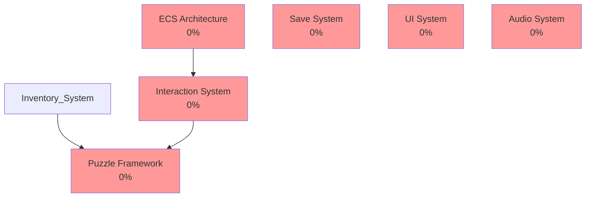

# MVP Quality Report

## Overall Metrics
- **Implementation:** 0%
- **Quality Score:** 0%
- **Combined Score:** 0%

## 🚨 Critical Blockers

- **Save System:** Save system not implemented
- **Puzzle Framework:** No puzzle framework exists
- **Audio System:** Audio system not implemented
- **Audio System:** No audio assets directory

## Feature Analysis

### ECS Architecture
- **Implementation:** 0%
- **Quality:** 0%
- **Overall:** 0%
- **Missing:**
  - Base entity class (Entity.swift)
  - Component protocol/base (Component.swift)
  - System base class (System.swift)

### Interaction System
- **Implementation:** 0%
- **Quality:** 0%
- **Overall:** 0%
- **Dependencies:** ECS Architecture

### Save System
- **Implementation:** 0%
- **Quality:** 0%
- **Overall:** 0%
- **Missing:**
  - SaveManager.swift

### Puzzle Framework
- **Implementation:** 0%
- **Quality:** 0%
- **Overall:** 0%
- **Missing:**
  - Base puzzle class
  - Puzzle state management
  - Solution checking
- **Dependencies:** Inventory System, Interaction System

### UI System
- **Implementation:** 0%
- **Quality:** 0%
- **Overall:** 0%

### Audio System
- **Implementation:** 0%
- **Quality:** 0%
- **Overall:** 0%
- **Missing:**
  - AudioManager.swift

## Dependency Graph

