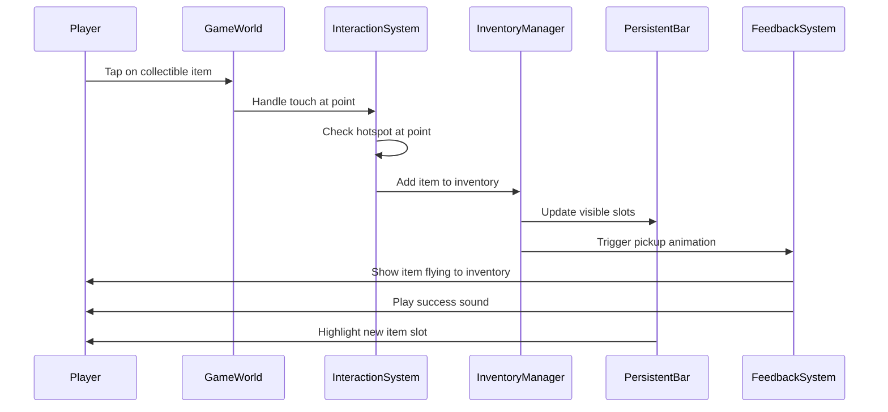
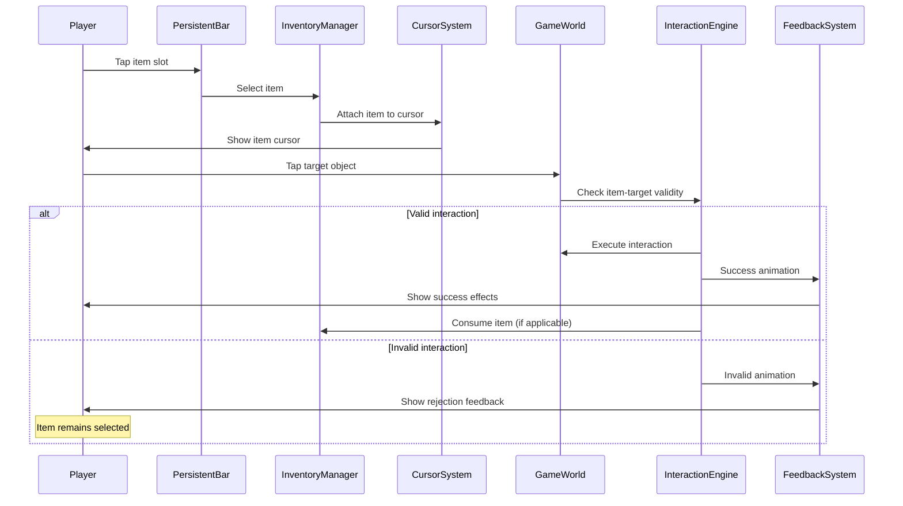
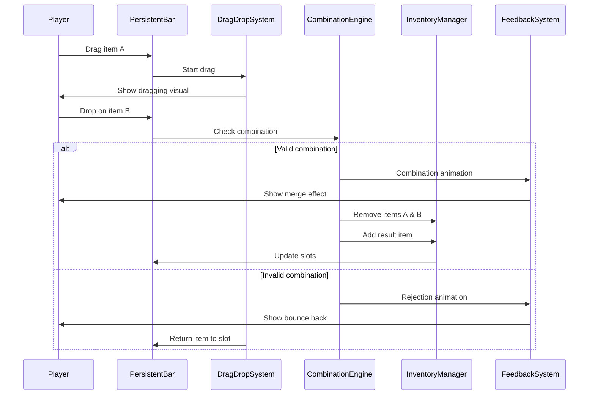
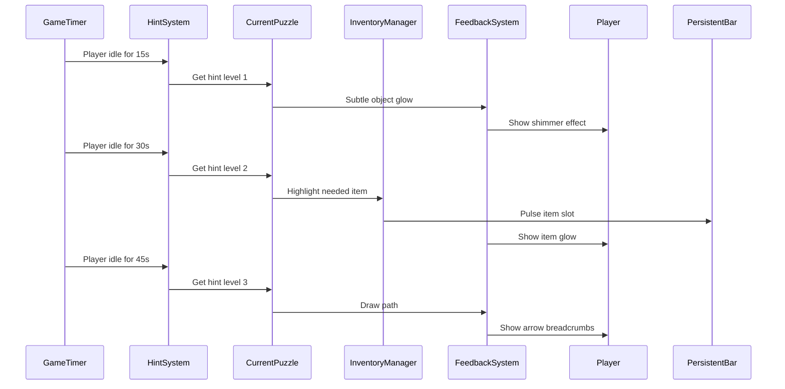
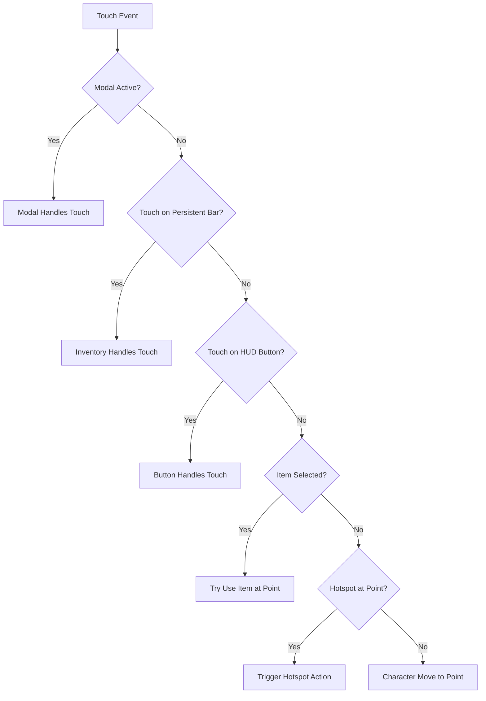
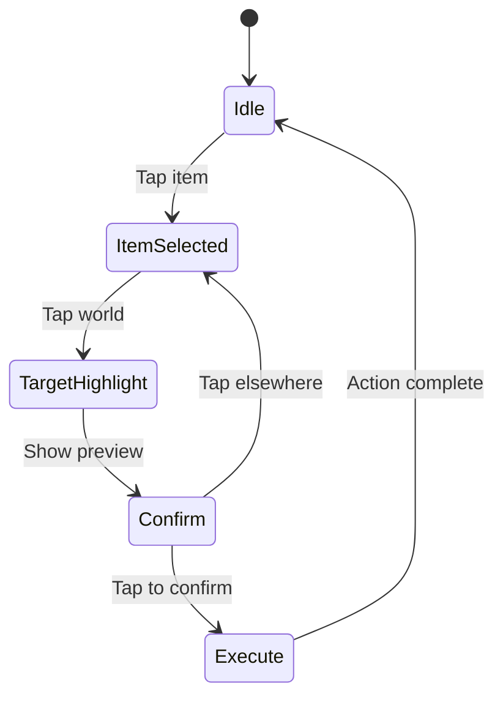

# HUD and Interaction Flow Architecture

## Overview
This document describes the complete interaction flow between the HUD system, inventory management, and game world interactions in Fish Puzzles. The system is designed to be intuitive for children aged 4-9 while maintaining the depth needed for puzzle-solving gameplay.

## System Components

### Core Systems
1. **HUD Manager**: Coordinates all UI overlays and persistent elements
2. **Inventory System**: Manages items and their interactions
3. **Interaction System**: Handles touch input and hotspot management
4. **Visual Feedback System**: Provides visual cues and affordances
5. **Game State**: Maintains current game and inventory state

## Interaction Flow Diagrams

### 1. Item Collection Flow


### 2. Item Selection and Usage Flow


### 3. Item Combination Flow


### 4. Progressive Hint Flow


## Touch Event Propagation

### Layer Priority (Top to Bottom)
```
1. Modal Overlays (Settings, Pause) - Block all touches below
2. Dialogue System - Blocks gameplay touches
3. Hint Overlays - Non-blocking, informational
4. Persistent Inventory Bar - Always receives touches
5. HUD Buttons - Always accessible
6. Game World - Receives touches not handled above
```

### Touch Handling Decision Tree


## State Management

### Inventory State
```swift
struct InventoryState {
    // Persistent bar state
    let visibleSlots: [Item?]      // 4-6 slots
    let selectedItem: Item?         // Currently selected
    let overflowCount: Int          // Items beyond visible
    
    // Full inventory state
    let allItems: [Item]            // Complete inventory
    let recentlyAdded: [Item]       // For highlighting
    let questItems: Set<Item>       // Priority items
}
```

### Interaction State
```swift
enum InteractionMode {
    case normal                     // Default state
    case itemSelected(Item)         // Item ready to use
    case dragging(Item, position)   // Dragging item
    case combining(Item, Item)      // Combination preview
    case dialogue                   // In conversation
    case cutscene                   // Non-interactive
}
```

## Visual Feedback States

### Item Slot Visual States
```swift
enum SlotVisualState {
    case empty                      // Gray, subtle
    case occupied                   // Normal item display
    case selected                   // Glowing border, scaled up
    case highlighted                // Pulsing for hints
    case validTarget                // Green glow (drop target)
    case invalidTarget              // Red pulse (can't drop)
    case recentlyAdded             // Sparkle effect
}
```

### Hotspot Visual States
```swift
enum HotspotVisualState {
    case idle                       // Subtle shimmer
    case nearby                     // Soft glow
    case hovering                   // Bright outline
    case validForItem              // Green highlight
    case invalidForItem            // Red flash
    case completed                 // Grayed out
}
```

## Performance Considerations

### Update Frequencies
- **Persistent Inventory Bar**: 60 FPS (always visible)
- **Hotspot Highlighting**: 30 FPS (less critical)
- **Particle Effects**: 60 FPS (when active)
- **Hint System**: 1 FPS (timer based)

### Memory Management
- **Maximum Visible Items**: 6 in persistent bar
- **Texture Atlas**: Single atlas for all inventory icons
- **Particle Pool**: Reuse particle emitters
- **Animation Cache**: Pre-load common animations

## Accessibility Features

### One-Touch Mode Flow


### Visual Accessibility
- **High Contrast Mode**: Stronger outlines, bolder colors
- **Reduced Motion**: Disable parallax, simplify animations
- **Colorblind Modes**: Alternative color schemes for feedback
- **Large Touch Targets**: Minimum 60pt for kids (vs 44pt standard)

## Integration Points

### With Save System
- Inventory state persisted on every change
- Selected item saved to restore on load
- Combination history tracked for analytics

### With Audio System
- Item pickup sounds
- Combination success/failure audio
- UI interaction sounds (tap, drag, drop)
- Hint appearance chimes

### With Analytics
- Track item usage patterns
- Monitor combination attempts
- Measure hint system effectiveness
- Record interaction success rates

## Error Handling

### Edge Cases
1. **Inventory Full**: Show "inventory full" animation, prevent pickup
2. **Invalid Drop Target**: Animate item back to slot
3. **Missing Item Assets**: Use placeholder, log error
4. **Touch During Transition**: Queue or ignore based on priority
5. **Rapid Tap Protection**: Debounce with 0.2s cooldown

## Testing Scenarios

### Critical Paths
1. Collect item → Select → Use on correct target
2. Drag item → Drop on another → Successful combination
3. Select item → Tap invalid target → Remains selected
4. Fill inventory → Try collect → See full message
5. Idle for 60s → See all hint levels progress

### Performance Tests
1. 20+ items in inventory with smooth scrolling
2. Multiple particle effects without frame drops
3. Rapid item selection without lag
4. Scene transition with inventory state preserved

## Future Enhancements

### Planned Features
1. **Quick Slots**: Favorite items for faster access
2. **Item Categories**: Sort by type (tools, food, keys)
3. **Combination Preview**: Show result before confirming
4. **Gesture Shortcuts**: Swipe to clear selection
5. **Smart Suggestions**: AI-driven item recommendations

### Potential Optimizations
1. **Predictive Loading**: Pre-load likely next items
2. **Adaptive Hints**: Adjust timing based on player skill
3. **Dynamic Slot Count**: Adjust visible slots by device size
4. **Batch Updates**: Group visual updates per frame