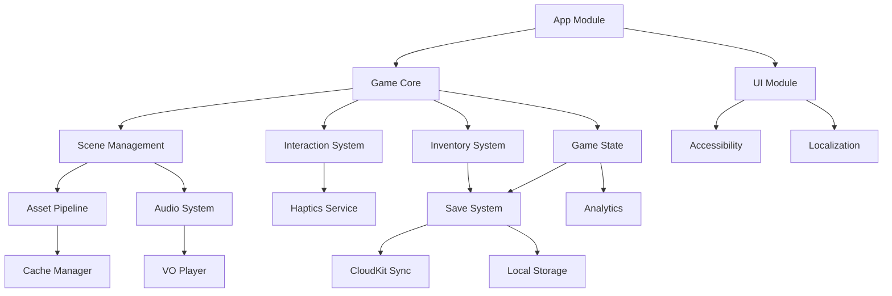

# Module Architecture & Dependencies

## Module Dependency Graph



## Module Specifications

### 1. App Module
**Purpose**: Application lifecycle, dependency injection, root coordination

```swift
// Module Structure
FishPuzzles/
├── AppDelegate.swift
├── SceneDelegate.swift
├── RootCoordinator.swift
├── DependencyContainer.swift
└── Configuration/
    ├── Info.plist
    ├── Entitlements.plist
    └── Settings.bundle
```

**Dependencies**: GameCore, UI
**Exports**: AppCoordinator protocol

---

### 2. Game Core Module
**Purpose**: Core game loop, state management, scene coordination

```swift
// Public API
public protocol GameEngine {
    func start()
    func pause()
    func resume()
    var currentState: GameState { get }
    func transition(to scene: SceneID)
}

// Module Structure
GameCore/
├── Sources/
│   ├── GameEngine.swift
│   ├── GameState.swift
│   ├── GameLoop.swift
│   └── Protocols/
│       ├── Scene.swift
│       ├── Updatable.swift
│       └── Renderable.swift
├── Tests/
└── Resources/
```

**Dependencies**: Scene, Interaction, Inventory, State
**Exports**: GameEngine, GameState, Scene protocols

---

### 3. Scene Management Module
**Purpose**: Scene lifecycle, transitions, resource management

```swift
// Public API
public class SceneManager {
    func loadScene(_ id: SceneID) async throws -> GameScene
    func preloadScene(_ id: SceneID)
    func unloadScene(_ id: SceneID)
    func transition(from: SceneID, to: SceneID, style: TransitionStyle)
}

// Module Structure
SceneManagement/
├── Sources/
│   ├── SceneManager.swift
│   ├── SceneFactory.swift
│   ├── SceneCache.swift
│   ├── Transitions/
│   │   ├── FadeTransition.swift
│   │   ├── SlideTransition.swift
│   │   └── IrisTransition.swift
│   └── Scenes/
│       ├── BaseScene.swift
│       ├── Location1Scene.swift
│       └── Location2Scene.swift
├── Tests/
└── Resources/
    └── SceneDefinitions/
```

**Dependencies**: Assets, Audio, SpriteKit
**Exports**: SceneManager, GameScene, Transition protocols

---

### 4. Interaction System Module
**Purpose**: Touch handling, gesture recognition, hotspot management

```swift
// Public API
public protocol InteractionHandler {
    func handleTouch(at point: CGPoint, in scene: GameScene)
    func handleDrag(from: CGPoint, to: CGPoint)
    func registerHotspot(_ hotspot: Hotspot)
}

// Module Structure
InteractionSystem/
├── Sources/
│   ├── InteractionManager.swift
│   ├── TouchHandler.swift
│   ├── GestureRecognizer.swift
│   ├── Hotspot.swift
│   └── Components/
│       ├── InteractableComponent.swift
│       ├── DraggableComponent.swift
│       └── TappableComponent.swift
├── Tests/
└── Resources/
```

**Dependencies**: Haptics, UIKit
**Exports**: InteractionHandler, Hotspot, Gesture types

---

### 5. Inventory System Module
**Purpose**: Item management, combination logic, persistent inventory bar, inventory UI

```swift
// Public API
public class InventoryManager {
    func addItem(_ item: Item)
    func removeItem(_ item: Item)
    func hasItem(_ item: Item) -> Bool
    func useItem(_ item: Item, on target: Entity) -> UseResult
    func combineItems(_ item1: Item, _ item2: Item) -> Item?
    func selectItem(_ item: Item)
    var items: [Item] { get }
    var selectedItem: Item? { get }
    var visibleSlots: [Item] { get }  // First 4-6 items
}

// Item interaction system
public protocol ItemInteractionEngine {
    func canUseItem(_ item: Item, on target: Entity) -> Bool
    func canCombineItems(_ item1: Item, _ item2: Item) -> Bool
    func getHint(for item: Item) -> String?
}

// Module Structure
InventorySystem/
├── Sources/
│   ├── InventoryManager.swift
│   ├── Item.swift
│   ├── ItemInteractionEngine.swift
│   ├── CombinationRules.swift
│   ├── CombinationDatabase.swift
│   ├── UI/
│   │   ├── PersistentInventoryBar.swift  // Always visible
│   │   ├── InventoryOverlay.swift        // Full modal view
│   │   ├── ItemSlot.swift
│   │   ├── DragDropHandler.swift
│   │   └── ItemCursor.swift              // Visual for selected item
│   ├── Components/
│   │   ├── CollectibleComponent.swift
│   │   ├── UsableComponent.swift
│   │   └── CombinableComponent.swift
│   └── Feedback/
│       ├── ItemFeedbackAnimator.swift
│       └── UsageResultHandler.swift
├── Tests/
└── Resources/
    ├── ItemDefinitions/
    └── CombinationRecipes/
```

**Dependencies**: UI, Persistence, Interaction System
**Exports**: InventoryManager, Item, ItemInteractionEngine, CombinationRule, PersistentInventoryBar

---

### 6. Audio System Module
**Purpose**: Music playback, voice-over, sound effects, mixing

```swift
// Public API
public class AudioManager {
    func playMusic(_ track: MusicTrack, fadeIn: TimeInterval = 0)
    func stopMusic(fadeOut: TimeInterval = 0)
    func playVO(_ line: VOLine) async
    func playSFX(_ effect: SoundEffect, at position: CGPoint? = nil)
    var masterVolume: Float { get set }
}

// Module Structure
AudioSystem/
├── Sources/
│   ├── AudioManager.swift
│   ├── MusicController.swift
│   ├── VOPlayer.swift
│   ├── SFXMixer.swift
│   ├── AudioCache.swift
│   └── Models/
│       ├── MusicTrack.swift
│       ├── VOLine.swift
│       └── SoundEffect.swift
├── Tests/
└── Resources/
    └── AudioCatalogs/
```

**Dependencies**: AVFoundation, CoreAudio
**Exports**: AudioManager, AudioAsset protocols

---

### 7. Save System Module
**Purpose**: Game state persistence, cloud sync, save slots

```swift
// Public API
public class SaveManager {
    func save(_ state: GameState, to slot: SaveSlot) async throws
    func load(from slot: SaveSlot) async throws -> GameState
    func syncWithCloud() async throws
    func deleteSave(at slot: SaveSlot) async throws
    var availableSlots: [SaveSlot] { get }
}

// Module Structure
SaveSystem/
├── Sources/
│   ├── SaveManager.swift
│   ├── LocalPersistence.swift
│   ├── CloudSync.swift
│   ├── ConflictResolver.swift
│   ├── Models/
│   │   ├── SaveGame.swift
│   │   ├── SaveSlot.swift
│   │   └── SaveMetadata.swift
│   └── Serialization/
│       ├── GameStateEncoder.swift
│       └── GameStateDecoder.swift
├── Tests/
└── Resources/
```

**Dependencies**: CloudKit, CoreData
**Exports**: SaveManager, SaveSlot, SaveGame

---

### 8. Asset Pipeline Module
**Purpose**: Resource loading, texture management, caching

```swift
// Public API
public class AssetLoader {
    func loadTexture(_ name: String) async throws -> SKTexture
    func loadAtlas(_ name: String) async throws -> SKTextureAtlas
    func preloadScene(_ sceneID: SceneID)
    func clearCache()
    var memoryUsage: Int { get }
}

// Module Structure
AssetPipeline/
├── Sources/
│   ├── AssetLoader.swift
│   ├── TextureCache.swift
│   ├── AtlasManager.swift
│   ├── MemoryManager.swift
│   └── Loaders/
│       ├── TextureLoader.swift
│       ├── AudioLoader.swift
│       └── DataLoader.swift
├── Tests/
├── Tools/
│   └── AtlasGenerator/
└── Resources/
```

**Dependencies**: Foundation, SpriteKit
**Exports**: AssetLoader, AssetCache protocols

---

### 9. Analytics Module
**Purpose**: Privacy-safe metrics collection

```swift
// Public API
public class Analytics {
    static func logEvent(_ event: GameEvent)
    static func setEnabled(_ enabled: Bool)
    static func exportData() -> Data?
    static func clearAllData()
}

// Module Structure
Analytics/
├── Sources/
│   ├── Analytics.swift
│   ├── EventProcessor.swift
│   ├── PrivacyGuard.swift
│   ├── DifferentialPrivacy.swift
│   └── Events/
│       ├── GameEvent.swift
│       ├── SceneEvent.swift
│       └── PuzzleEvent.swift
├── Tests/
└── Resources/
```

**Dependencies**: None (intentionally isolated)
**Exports**: Analytics, GameEvent

---

### 10. UI Module
**Purpose**: User interface components, HUD, menus

```swift
// Public API
public class UIManager {
    func showMainMenu()
    func showPauseMenu()
    func showSettings()
    func showHUD(for scene: GameScene)
    func showDialogue(_ dialogue: Dialogue)
}

// Module Structure
UIModule/
├── Sources/
│   ├── UIManager.swift
│   ├── Screens/
│   │   ├── MainMenuView.swift
│   │   ├── PauseMenuView.swift
│   │   ├── SettingsView.swift
│   │   └── ParentalGateView.swift
│   ├── HUD/
│   │   ├── HUDView.swift
│   │   ├── HintButton.swift
│   │   └── ProgressIndicator.swift
│   └── Components/
│       ├── DialogueBox.swift
│       ├── Button.swift
│       └── Slider.swift
├── Tests/
└── Resources/
    └── UIAssets/
```

**Dependencies**: UIKit, SwiftUI, Accessibility
**Exports**: UIManager, View components

---

### 11. Localization Module
**Purpose**: Multi-language support, string management

```swift
// Public API
public class Localization {
    static func string(for key: String) -> String
    static func setLanguage(_ code: String)
    static var currentLanguage: String { get }
    static var supportedLanguages: [String] { get }
}

// Module Structure
Localization/
├── Sources/
│   ├── LocalizationManager.swift
│   ├── StringTable.swift
│   ├── VOMapper.swift
│   └── Formatters/
│       ├── DateFormatter.swift
│       └── NumberFormatter.swift
├── Tests/
└── Resources/
    └── Localizations/
        ├── en.lproj/
        └── [future languages]/
```

**Dependencies**: Foundation
**Exports**: Localization, LocalizedString

---

### 12. Accessibility Module
**Purpose**: VoiceOver, Dynamic Type, accessibility features

```swift
// Public API
public class AccessibilityManager {
    func configure(for element: UIView)
    func announceChange(_ text: String)
    var isVoiceOverEnabled: Bool { get }
    var preferredTextSize: CGFloat { get }
}

// Module Structure
Accessibility/
├── Sources/
│   ├── AccessibilityManager.swift
│   ├── VoiceOverAdapter.swift
│   ├── DynamicTypeHandler.swift
│   └── Traits/
│       ├── AccessibilityTraits.swift
│       └── AccessibilityActions.swift
├── Tests/
└── Resources/
```

**Dependencies**: UIKit
**Exports**: AccessibilityManager, AccessibilityTraits

## Module Communication Patterns

### Event Bus
```swift
// Central event system for loose coupling
class EventBus {
    static func publish<T: Event>(_ event: T)
    static func subscribe<T: Event>(to type: T.Type, handler: @escaping (T) -> Void)
}
```

### Dependency Injection
```swift
// Container-based DI
class DependencyContainer {
    func register<T>(_ type: T.Type, factory: @escaping () -> T)
    func resolve<T>(_ type: T.Type) -> T
}
```

### Protocol-Based Communication
```swift
// Modules communicate through protocols
protocol SceneDelegate: AnyObject {
    func sceneDidLoad(_ scene: GameScene)
    func sceneWillTransition(from: GameScene, to: GameScene)
}
```

## Build Configuration

### Module Targets
```yaml
targets:
  - name: GameCore
    type: framework
    platform: iOS
    deploymentTarget: "16.0"
    
  - name: SceneManagement
    type: framework
    dependencies: [GameCore, AssetPipeline]
    
  - name: FishPuzzles
    type: application
    dependencies: [all modules]
```

### Testing Strategy
- Each module has isolated unit tests
- Integration tests in app target
- UI tests for critical user flows
- Performance tests for resource loading

## Module Versioning
- Semantic versioning for each module
- Compatible version ranges in dependencies
- Automated compatibility testing in CI